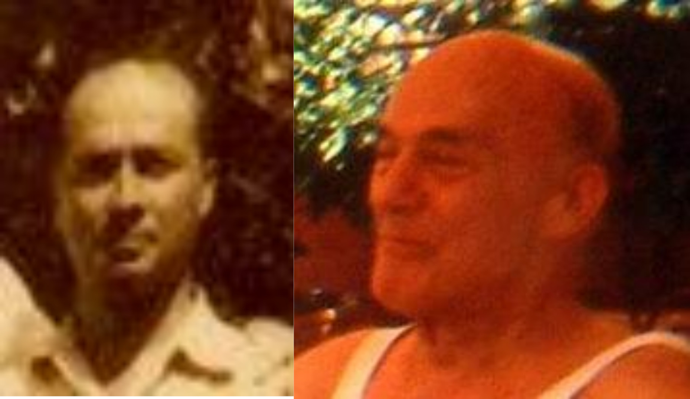
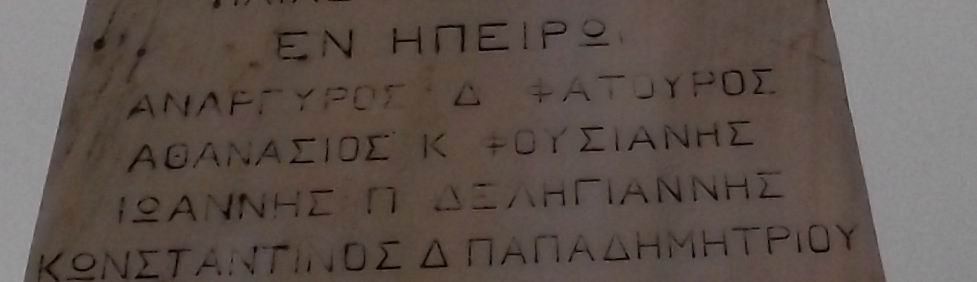
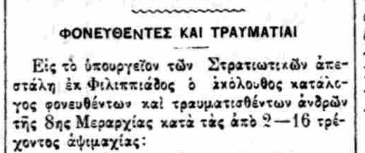
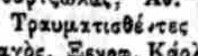
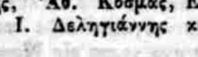

## Εισαγωγή: Ο μικρός αδελφός του πατέρα μου

Ο πατέρας μου, οικογένεια  Δεληγιάννη, καταγόταν από τη Στεμνίτσα Γορτυνίας/ Αρκαδίας. Ήταν επτά αδέλφια: Δημήτρης (Μήτσος), Κωνσταντίνα (Ντίνα), Αργύρης, Χρήστος, Αικατερίνη (Κατίνα), Ιωάννης (Γιάννης) και Θεόδωρος (Θοδωράκης, ο πατέρας μου, ο μικρότερος). Ο πατέρας μου είχε με το Μήτσο 20 χρόνια διαφορά.

Ο Ιωάννης, Γιάννης, ήταν ο προτελευταίος. Ο Γιάννης πολέμησε στον πόλεμο του 1912 και έπεσε στο Μπιζάνι. Πρέπει να είχε γεννηθεί γύρω στα 1890. Όλα τα αδέλφια του έδωσαν τα ονόματα των γονιών Παναγιώτης και Πηνελόπη στα παιδιά τους. Μόνο η αδελφή του Αικατερίνη (Γεωργιος Τσερπές ήταν ο σύζυγος) όπως συνηθιζόταν με βάση τη σειρά έδωσε το όνομα Ιωάννης από την οικογένεια της στο δεύτερο παιδί της, συγκεκριμένα στο δεύτερο αγόρι της. 


Ο πατέρας Παναγιώτης πρέπει κατά τον πατέρα μου να έπαθε κατάθλιψη και να πέθανε σχεδόν αμέσως μετά τον Θάνατο του Γιάννη, πέφτοντας από το άλογο. Το μόνο πράγμα που υπήρχε από το Γιάννη στην οικογένεια κ είχε η μεγαλύτερη αδελφή του (Ντίνα), ήταν ένα  τετράδιο που έγραφε ποιήματα. Ελπίζω πάντα να το βρώ και να το αντιγράψω. 



Από την παλιότερη φωτογραφία  της οικογενείας (πάνω δεξιά), υπολογίζω το 1922, που βγήκε πριν φύγει ο πατέρας μου στη Γερμανία/ Κίελο για να σπουδάσει χημεία, επεξεργαζόμενος τα χαρακτηριστικά του πατέρα μου έφτιαξα την εικόνα του πως θα έπρεπε να είναι ο θείος εφόσον ο πατέρας μου ήταν τότε στην ηλικία που έπεσε ο Ιωάννης. Σην οικογενειακή φωτογραφία, στη μέση αριστερά είναι ο γαμπρός του σύζυγος της Κατερίνας αριστερά και δεξιά ο αδελφός του πατέρα μου Αργύρης.


Το όνομα του είναι χαραγμένο στο ηρώο των πεσόντων του χωριού του στη Στεμνίτσα. Είναι χαραγμένο κάτω από τον τίτλο  «Πεσόντες εν Ηπείρω», στην πλευρά που πρωτοαντικρίζει ο επισκέπτης, καθώς ανεβαίνει τα σκαλιά του λοφίσκου στην κορφή του οποίου βρίσκεται το Ηρώο. Στις τρεις άλλες πλευρές του Ηρώου, τα ονόματα είναι καταχωρημένα με αλφαβητική σειρά  με το πατρώνυμο πρώτο. Στην πλευρά αυτή του ηρώου σε αντίθεση με τις τρεις άλλες πλευρές τα ονόματα είναι καταχωρημένα με αλφαβητική σειρά  με το μικρό όνομα πρώτο.  Έτσι έχουμε παγκόσμια πρωτοτυπία σε ό,τι αφορά στρατιωτικό κατάλογο ονομάτων ή μνημείο πεσόντων. Ακόμα και με αυτό τον τρόπο έχουμε το "Ανάργυρος" πριν το "Αθανάσιος", έχουμε δηλαδή την σειρά ονομάτων που θέλουμε. Χαραγμένη στο μάρμαρο η μικροψυχία του τόπου.



Αποτάνθηκα κατά καιρούς στον στρατό (ΔΙΣ, για τους πεσόντες του 1912 στην Ήπειρο, δεν έχουν τίποτα, στο Δήμο (Γορτυνίας), στην κοινότητα (Στεμνίτσας), σε μουσεία (Θεσσαλονίκη), χωρίς  αποτέλεσμα ή μάλλον  συναντώντας και αποκαρδιωτικές συμπεριφορές.Για πολλοστή φορά φέτος που είναι τα 200 χρόνια της ελληνικής ιστορίας προσπάθησα να βρώ κάποιο στοιχείο.

Με υπόδειξη και προτροπή και βοήθεια δυο φίλων μου έψαξα συστηματικά για την περίοδο αρχές Δεκεμβρίου 1912, μια που η κυρίως [μάχη στο Μπιζάνι](https://el.wikipedia.org/wiki/%CE%9C%CE%AC%CF%87%CE%B7_%CF%84%CE%BF%CF%85_%CE%9C%CF%80%CE%B9%CE%B6%CE%B1%CE%BD%CE%AF%CE%BF%CF%85) ξεκινάει 9 Δεκεμβρίου μέχρι και τέλος Μαρτίου 1913. Κατέβασα 85 αρχεία και έψαξα εκατοντάδες ονόματα. Από κάποια σύμπτωση, τον κατάλογο τραυματιών – πεσόντων που με ενδιέφερε τον βρήκα τελευταίο και το όνομα του θείου μου Ιωάννη είναι το πρό–τελευταίο. Ο πίνακας αρχίζει έτσι: 



1913-1-28 αναφέρεται ενιαία το ανωτέρω κείμενο και κατάλογος πεσόντων και τραυματιών της 8ης Μεραρχίας από τις αψιμαχίες που έγιναν από τις 2 εως τις 16 Ιανουαρίου 1913 (δοθέντος ότι η μάχη στο Μπιζάνι φαίνεται να ξεκινάει στις 9 Δεκεμβρίου 1912). Η έκφραση «αψιμαχίες» γύρω από το Μπιζάνι ήταν αυτή που θυμάμαι από τον πατέρα μου και αδελφό του. 



Στον κατάλογο ο "Ι. Δεληγιάννης" είναι κάτω από τον τίτλο τραυματισθέντες το προτελευταίο όνομα.



Έχω βρεί ακόμα έναν Ανδρέα και έναν Ευάγγελο Δεληγιάννη και έναν Ιωάννη Δηλιγιάννη Αξιωματικό. Κατέβασα 85 αρχεία και έψαξα εκατοντάδες ονόματα. Υπολογίζω ότι βρήκα 1500 πεσόντες-τραυματίες και εξ αυτών σε χωριστό πλήρη κατάλογο 150 βαθμοφόρους.

Τη συλλογή αυτή εν ήδη ηλεκτρονικού την αφιερώνω στους ανώνυμους και επώνυμους πεσόντες και στο θείο μου.

Δεληγιάννης Ανδρέας, Θεσσαλονίκη, Δεκέμβριος 2021.

### Markdown

Markdown is a lightweight and easy-to-use syntax for styling your writing. It includes conventions for

```markdown
Syntax highlighted code block

# Header 1
## Header 2
### Header 3

- Bulleted
- List

1. Numbered
2. List

**Bold** and _Italic_ and `Code` text

[Link](url) and 
```

For more details see [GitHub Flavored Markdown](https://guides.github.com/features/mastering-markdown/).

### Jekyll Themes

Your Pages site will use the layout and styles from the Jekyll theme you have selected in your [repository settings](https://github.com/ioannis-del-iroo/ioannis-del-iroo.github.io/settings/pages). The name of this theme is saved in the Jekyll `_config.yml` configuration file.

### Support or Contact

Having trouble with Pages? Check out our [documentation](https://docs.github.com/categories/github-pages-basics/) or [contact support](https://support.github.com/contact) and we’ll help you sort it out.
